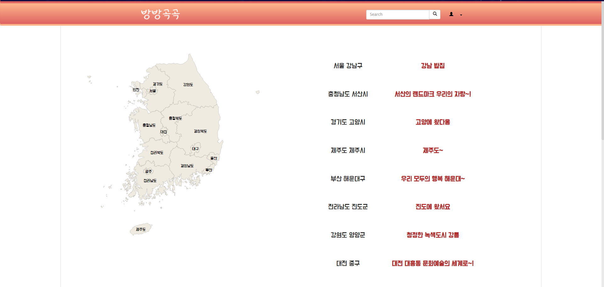
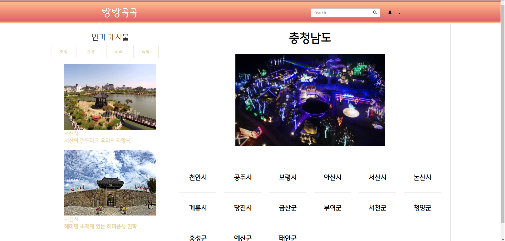
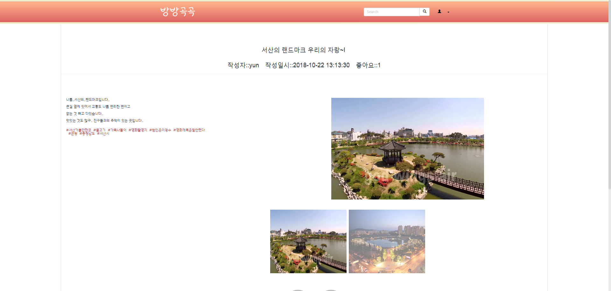
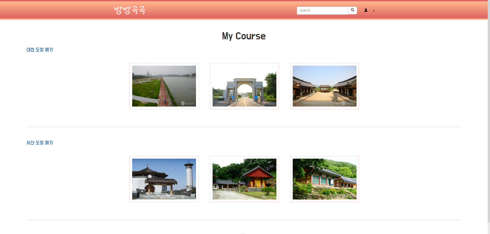
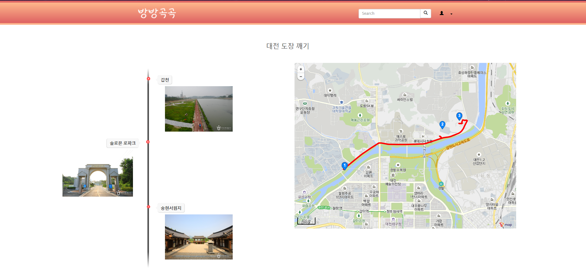

# TourProject

국내 여행 정보 SNS 사이트 (/doc/miniproject3 :: ppt)

교육 중 미니 팀 프로젝트로 MVC 패턴을 사용하여 Web Applicaion 구현
일반적인 여행 정보 사이트는 주로 중계가 주를 이루기 때문에 사용자들이 가장 많이 찾는 정보인 '리뷰' 중심의 사이트를 만듬.

stack - java, javascript(jquery, bootstrap), oracle(AWS RDS), apache-tomcat7
<h3 aling="center">Main Page</h3>
  
<h3 aling="center">Location</h3>
  
<h3 aling="center">Board</h3>
  
<h3 aling="center">Course</h3>
  
  

